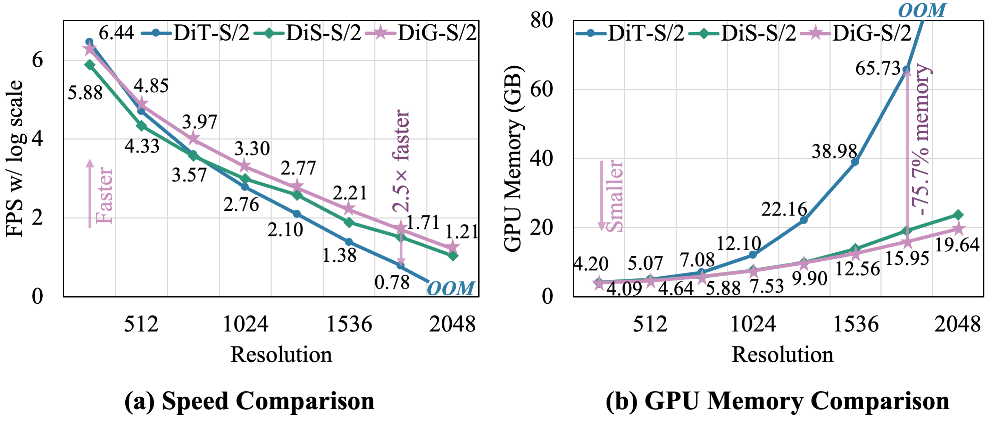
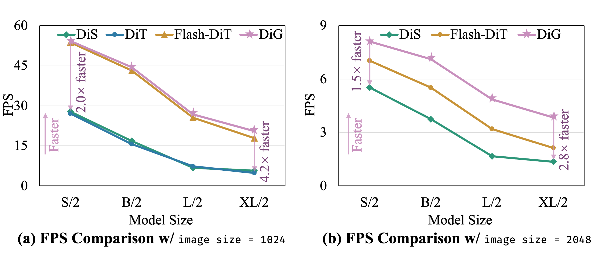
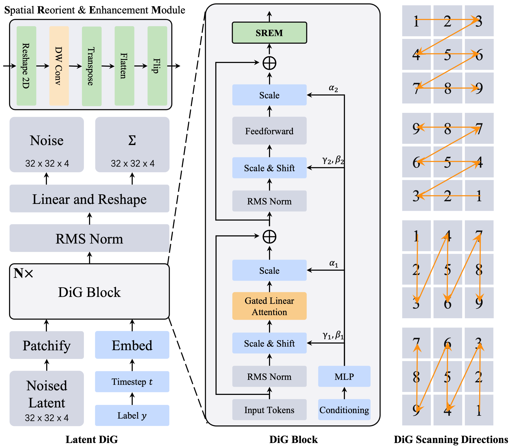

<div align="center">
<h1>Diffusion GLA (DiG) </h1>
<h3>Scalable and Efficient Diffusion Models with Gated Linear Attention</h3>

[Lianghui Zhu](https://github.com/Unrealluver)<sup>1,2</sup>,[Zilong Huang](https://speedinghzl.github.io/)<sup>2 :email:</sup>,[Bencheng Liao](https://github.com/LegendBC)<sup>1</sup>,[Jun Hao Liew](https://scholar.google.com/citations?user=8gm-CYYAAAAJ&hl=zh-CN&oi=ao)<sup>2</sup>, [Hanshu Yan](https://hanshuyan.github.io/)<sup>2</sup>, [Jiashi Feng](https://sites.google.com/site/jshfeng/)<sup>2</sup>, [Xinggang Wang](https://xwcv.github.io/)<sup>1 :email:</sup>

<sup>1</sup> School of EIC, Huazhong University of Science and Technology, <sup>2</sup>  ByteDance

(<sup>:email:</sup>) corresponding author.

ArXiv Preprint ([arXiv 2405.18428](https://arxiv.org/abs/2405.18428))


</div>


#


### News

* **` May. 28th, 2024`:** We released our paper on Arxiv. Code/Models are coming soon. Please stay tuned! ☕️


## Abstract
Diffusion models with large-scale pre-training have achieved significant success in the field of visual content generation, particularly exemplified by Diffusion Transformers (DiT). However, DiT models have faced challenges with scalability and quadratic complexity efficiency. In this paper, we aim to leverage the long sequence modeling capability of Gated Linear Attention (GLA) Transformers, expanding its applicability to diffusion models. We introduce Diffusion Gated Linear Attention Transformers (DiG), a simple, adoptable solution with minimal parameter overhead, following the DiT design, but offering superior efficiency and effectiveness. In addition to better performance than DiT, DiG-S/2 exhibits $2.5\times$ higher training speed than DiT-S/2 and saves $75.7%$ GPU memory at a resolution of $1792 \times 1792$. Moreover, we analyze the scalability of DiG across a variety of computational complexity. DiG models, with increased depth/width or augmentation of input tokens, consistently exhibit decreasing FID. We further compare DiG with other subquadratic-time diffusion models. With the same model size, DiG-XL/2 is $4.2\times$ faster than the recent Mamba-based diffusion model at a $1024$ resolution, and is $1.8\times$ faster than DiT with CUDA-optimized FlashAttention-2 under the $2048$ resolution. All these results demonstrate its superior efficiency among the latest diffusion models.


<div align="center">

</div>
<div align="center">

</div>

## Overview
<div align="center">

</div>

## Envs. for Training

- Python 3.9.2

  - `conda create -n your_env_name python=3.9.2`

- torch 2.1.1 + cu118
  - `pip3 install torch==2.2.0 torchvision==0.17.0 torchaudio==2.2.0 --index-url https://download.pytorch.org/whl/cu121`

- Requirements: 
  ```bash
  # triton
  pip3 install triton

  # GLA
  git clone https://github.com/sustcsonglin/flash-linear-attention
  git checkout 36743f3f14e47f23c1ad45cf5de727dbacb5600e
  cd flash-linear-attention
  pip3 install -e .

  # others
  pip3 install diffusers
  pip3 install tensorboard
  pip3 install timm
  pip3 install transformers
  pip3 install accelerate
  pip3 install fvcore
  pip3 install opt_einsum
  pip3 install torchdiffeq
  pip3 install ftfy
  pip3 install PyAV
  ```

## Train Your DiG
- Set your VAE path in `train-multi-nodes.py`.
- Set your `DATA_PATH` in `scripts/dig_s_d2_in1k_256_bs256_1node.sh`.
- Run `bash DiG/scripts/dig_s_d2_in1k_256_bs256_1node.sh no_env_install`.


## Acknowledgement :heart:
This project is based on GLA ([paper](https://arxiv.org/abs/2312.06635), [code](https://github.com/berlino/gated_linear_attention)), flash-linear-attention ([code](https://github.com/sustcsonglin/flash-linear-attention)), DiT ([paper](http://arxiv.org/abs/2212.09748), [code](https://github.com/facebookresearch/DiT)), OpenDiT ([code](https://github.com/NUS-HPC-AI-Lab/OpenDiT)). Thanks for their wonderful works.

## Citation
If you find DiG is useful in your research or applications, please consider giving us a star 🌟 and citing it by the following BibTeX entry.

```bibtex
@article{dig,
      title={DiG: Scalable and Efficient Diffusion Models with Gated Linear Attention}, 
      author={Lianghui Zhu and Zilong Huang and Bencheng Liao and Jun Hao Liew and Hanshu Yan and Jiashi Feng and Xinggang Wang},
      year={2024},
      eprint={2405.18428},
      archivePrefix={arXiv},
      primaryClass={cs.CV}
}
```